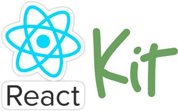

<p align="center">
  
</p>

<p align="center">
  <a href="https://github.com/egjiri/react-kit/actions?query=workflow%3ACI+branch%3Amaster">
    
  </a>
  <a href="https://badges.zoostage.com/egjiri/react-kit/master.svg">
    
  </a>
</p>

A collection of useful React utility functions and components that can be used across projects. Written in TypeScript.

## Installation
Install through npm:
```
npm install @egjiri/react-kit
```

Install through yarn:
```
yarn add @egjiri/react-kit
```

## Usage Examples
```js
import { buildClassName } from '@egjiri/react-kit/utils'

const className = 'card';
const isActive = true;
const isHidden = false;

buildClassName('static', className, isActive && 'active', isHidden && 'hidden');
// => "static card active"
```

## Development
1. Install dependencies: `yarn`
1. Run tests `yarn test` (tests automatically re-run when TypeScript src files change)
1. Start Coding!

## Release

This project is released through GitHub Actions workflows that:
1. Run the test suite and linters
1. Build the TypeScript codebase into a build folder with JavaScript and TypeScript type definition files.
1. Publish the build folder to the NPM Registry.
